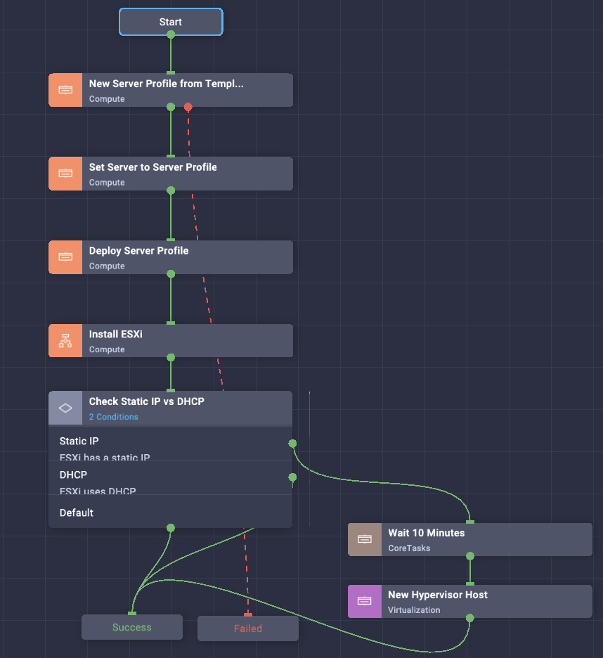
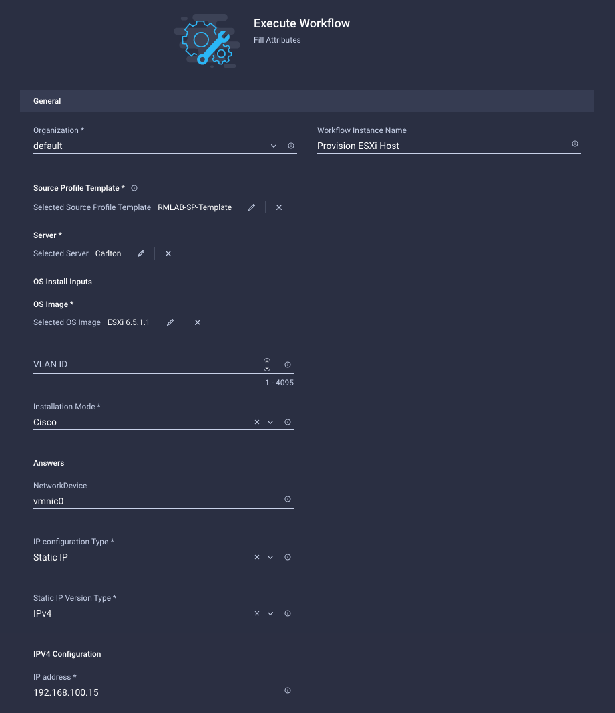
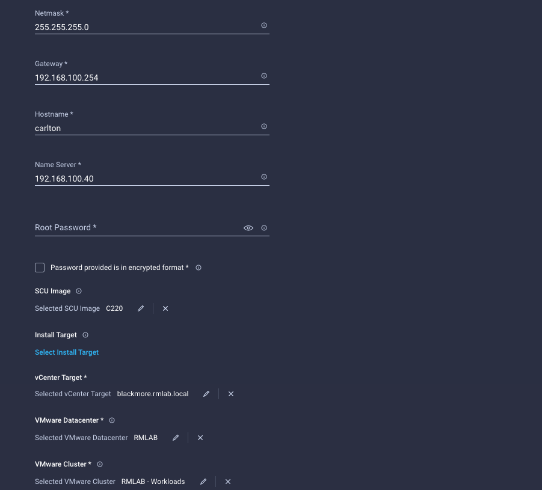
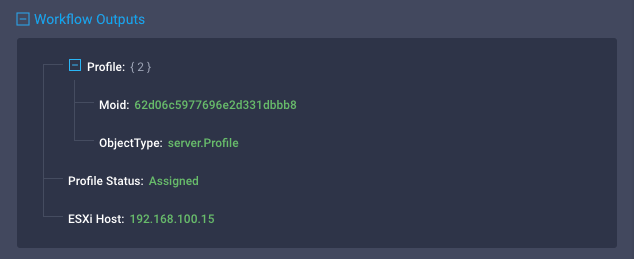

# Provision ESXi Server
###### Filename: `Export_Workflow_ProvisionESXiHost.json`
###### Category: `Virtualization`

## Use Case
ESXi Host installation and onboarding in an existing vSphere Cluster

## Overview
This workflow implements the following automation tasks:

- Clone a Server Profile from an existing Server Profile Template
- Map the created Server Profile to a server
- Deploy the created Server Profile
- Install ESXi on the server
- Check if the server uses a static IP or DHCP
	- If the IP is static, assign the host to an existing vSphere Cluster
	- If the IP is dynamic the workflows skips host claim on vSphere (users need to check the server IP, assign manually or use ICO 'New Hypervisor Host' separately

### Inputs

- Source Profile Template (mandatory)
- Server (mandatory)
- OS Install Inputs (mandatory)
- vCenter Target (mandatory)
- VMware Datacenter (mandatory)
- VMware Cluster (mandatory)

### Outputs

- Server Profile Moid
- Profile Status
- ESXi Host (if server uses Static IP)

## Claimed Targets

- Standalone C-Series UCS Server or IMM Server
- vCenter

## Prerequisites

- Configured OS Image in ADMIN -> Software Repository -> OS Image Links
- Configured SCU in ADMIN -> Software Repository -> SCU Links

## Notes

- See [Intersight Operating System Installation Guide](https://intersight.com/help/saas/resources/installing_an_operating_system) for compatibility matrix and support
- Visit [Cisco Software Central](https://software.cisco.com) to download the latest SCU image for your servers 

## Screenshots

#### Workflow Overview

#### Input Example

 

#### Output Example

